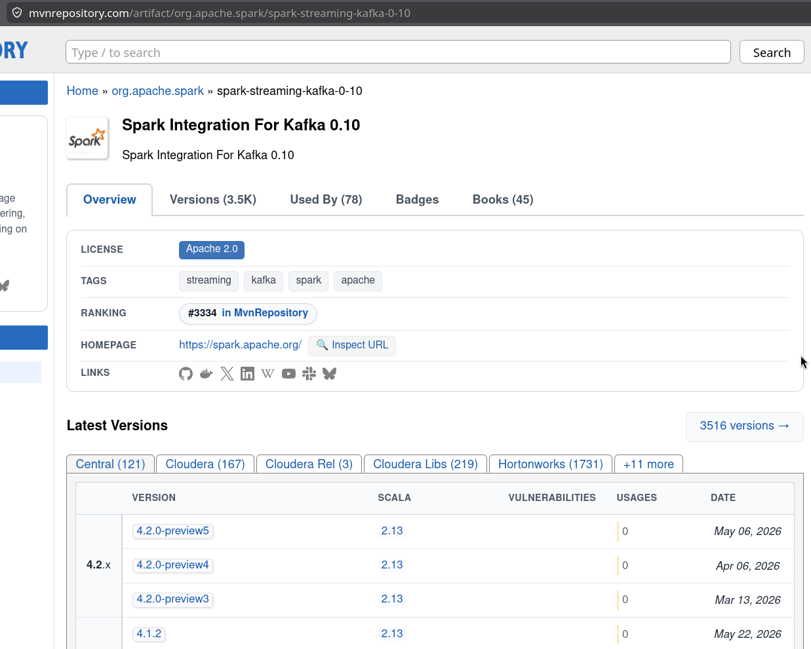
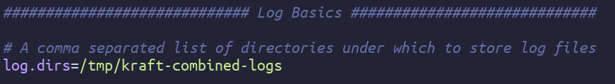
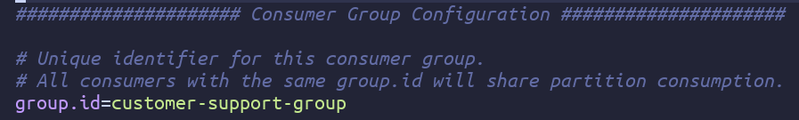

# Apache Spark and Kafka Integration 


| Author | 
| ------ |
| Dr. Bambang Purnomosidi D. P. |


Note: This material uses Apache Spark 4.1.2 and Apache Kafka 4.3.1 (latest as of June 2026). Read our [post on Substack](https://neoakselerasiindonesia.substack.com/p/streaming-data-pipelines-apache-spark) for older Apache Spark 4.1.0 and Apache Kafka 4.1.1 version.

[Apache Kafka](https://kafka.apache.org) is a free software for distributed event streaming. Kafka is arguably the most widely used software in the industry (Apache Kafka claims it’s used in over 80% of Fortune 100 companies). Meanwhile, [Apache Spark](https://spark.apache.org) itself is also a powerful and widely used software for data engineering processes, with advanced features available both officially ([MLlib](https://spark.apache.org/mllib/) for Machine Learning) and from third parties ([SparkNLP](https://sparknlp.org/) for natural language processing).

Interestingly, the two software are closely related and offer extensive support for their integration libraries. This will enable data engineering teams to integrate well-organized streaming data pipelines. The library for this integration is Spark Integration for Kafka (spark-streaming-kafka). This library can be found at [this maven repository](https://mvnrepository.com/artifact/org.apache.spark/spark-streaming-kafka-0-10). There are usually two version numbers in the library: 0.10 (or older version: 0.9) for its integration features and the next version (e.g. 4.1.2) for a supported Apache Spark version).



This post will provide a complete example using Scala to read data received after subscribing to a specific topic and then count the number of words in each. The source code for this purpose is already available in the Apache Spark distribution; we’ve added source code management for using sbt. The complete source code can be found in [this source directory](src-spark-kafka/).

**Note**:

1. The commands you type depend on the shell you’re using. The examples given use Bash. If you use a different shell or PowerShell on Windows, adjust the commands accordingly.
2. We use Apache Spark 4.1.2 and Apache Kafka 4.3.1. This document assumes both software are already installed and fully functional (simply download and extract them to a directory, then set the PATH to include the bin directories for Spark and Kafka).
3. The Apache Spark used in this document is Apache Spark without connect server.
4. In this document, $SPARK_HOME refers to the directory where Apache Spark was extracted. $KAFKA_HOME refers to the directory where Apache Kafka was extracted. The commands you type do not refer to the SPARK_HOME or KAFKA_HOME directories because $PARK_HOME/bin and $KAFKA_HOME/bin are already in the $PATH.

## Create UUID for cluster

A UUID (Universally Unique Identifier) - often called a GUID (Globally Unique Identifier) - is a unique 128-bit number represented as a string of characters. The generated ID is unique globally. The following command sets the cluster UUID using Bash:

```bash
$ KAFKA_CLUSTER_ID=$(kafka-storage.sh random-uuid)
$ echo $KAFKA_CLUSTER_ID
BCwXNt0ZS5uM3ItkgBAouw
$
```

## Log directory format 

Apache Kafka stores logs in a specific directory. Please change the directory you choose by changing the location in `$KAFKA_HOME/config/server.properties`.



Format with the following command:

```bash
$ kafka-storage.sh format -standalone -t $KAFKA_CLUSTER_ID -c $KAFKA_HOME/config/server.properties
```

Output:

```bash 
$ kafka-storage.sh format -standalone -t $KAFKA_CLUSTER_ID -c $KAFKA_HOME/config/server.properties
Bootstrap metadata: BootstrapMetadata(records=[ApiMessageAndVersion(FeatureLevelRecord(name='metadata.version', featureLevel=30) at version 0), ApiMessageAndVersion(FeatureLevelRecord(name='eligible.leader.replicas.version', featureLevel=1) at version 0), ApiMessageAndVersion(FeatureLevelRecord(name='group.version', featureLevel=1) at version 0), ApiMessageAndVersion(FeatureLevelRecord(name='share.version', featureLevel=1) at version 0), ApiMessageAndVersion(FeatureLevelRecord(name='streams.version', featureLevel=1) at version 0), ApiMessageAndVersion(FeatureLevelRecord(name='transaction.version', featureLevel=2) at version 0)], metadataVersionLevel=30, source=format command)
Formatting dynamic metadata voter directory /tmp/kraft-combined-logs with metadata.version 4.3-IV0.
$
```

Run the Apache Kafka server

```bash
$ kafka-server-start.sh $KAFKA_HOME/config/server.properties
```

Output:

```bash 
...
...
	transaction.state.log.replication.factor = 1
	transaction.state.log.segment.bytes = 104857600
	transaction.two.phase.commit.enable = false
	transactional.id.expiration.ms = 604800000
	unclean.leader.election.enable = false
	unclean.leader.election.interval.ms = 300000
	unstable.api.versions.enable = false
	unstable.feature.versions.enable = false
 (org.apache.kafka.common.config.AbstractConfig)
[2026-06-26 14:44:02,409] INFO [BrokerServer id=1] Waiting for the broker to be unfenced (kafka.server.BrokerServer)
[2026-06-26 14:44:02,438] INFO [BrokerLifecycleManager id=1] The broker has been unfenced. Transitioning from RECOVERY to RUNNING. (org.apache.kafka.server.BrokerLifecycleManager)
[2026-06-26 14:44:02,438] INFO [BrokerServer id=1] Finished waiting for the broker to be unfenced (kafka.server.BrokerServer)
[2026-06-26 14:44:02,439] INFO authorizerStart completed for endpoint PLAINTEXT. Endpoint is now READY. (org.apache.kafka.server.network.EndpointReadyFutures)
[2026-06-26 14:44:02,439] INFO [SocketServer listenerType=BROKER, nodeId=1] Enabling request processing. (kafka.network.SocketServer)
[2026-06-26 14:44:02,439] INFO Awaiting socket connections on 0.0.0.0:9092. (kafka.network.DataPlaneAcceptor)
[2026-06-26 14:44:02,440] INFO [BrokerServer id=1] Waiting for all of the authorizer futures to be completed (kafka.server.BrokerServer)
[2026-06-26 14:44:02,440] INFO [BrokerServer id=1] Finished waiting for all of the authorizer futures to be completed (kafka.server.BrokerServer)
[2026-06-26 14:44:02,440] INFO [BrokerServer id=1] Waiting for all of the SocketServer Acceptors to be started (kafka.server.BrokerServer)
[2026-06-26 14:44:02,440] INFO [BrokerServer id=1] Finished waiting for all of the SocketServer Acceptors to be started (kafka.server.BrokerServer)
[2026-06-26 14:44:02,440] INFO [BrokerServer id=1] Transition from STARTING to STARTED (kafka.server.BrokerServer)
[2026-06-26 14:44:02,441] INFO Kafka version: 4.3.1 (org.apache.kafka.common.utils.AppInfoParser)
[2026-06-26 14:44:02,441] INFO Kafka commitId: 26b251a451ce941d (org.apache.kafka.common.utils.AppInfoParser)
[2026-06-26 14:44:02,441] INFO Kafka startTimeMs: 1782459842440 (org.apache.kafka.common.utils.AppInfoParser)
[2026-06-26 14:44:02,443] INFO [KafkaRaftServer nodeId=1] Kafka Server started (kafka.server.KafkaRaftServer)

```

## Create a topic 

In Apache Kafka, a topic is the basic unit for organizing and storing events. Producers write events to a topic, and consumers read what the producers have written. Launch another terminal/shell. Then, from that new shell, create a topic with the following command:

```bash 
$ kafka-topics.sh --create --topic customersupport --bootstrap-server localhost:9092
Created topic customersupport.
$
```

In the shell where the Apache Kafka server is activated, a log appears indicating that the customersupport topic has been created.

```bash 
...
...
[2026-06-26 14:47:19,108] INFO [ReplicaFetcherManager on broker 1] Removed fetcher for partitions Set(customersupport-0) (kafka.server.ReplicaFetcherManager)
[2026-06-26 14:47:19,121] INFO [LogLoader partition=customersupport-0, dir=/tmp/kraft-combined-logs] Loading producer state till offset 0 (org.apache.kafka.storage.internals.log.UnifiedLog)
[2026-06-26 14:47:19,122] INFO Created log for partition customersupport-0 in /tmp/kraft-combined-logs/customersupport-0 with properties {} (kafka.log.LogManager)
[2026-06-26 14:47:19,123] INFO [Partition customersupport-0 broker=1] No checkpointed highwatermark is found for partition customersupport-0 (kafka.cluster.Partition)
[2026-06-26 14:47:19,124] INFO [Partition customersupport-0 broker=1] Log loaded for partition customersupport-0 with initial high watermark 0 (kafka.cluster.Partition)

```

## Enable the Apache Kafka console for the producer

```bash
$ kafka-console-producer.sh --topic customersupport --bootstrap-server localhost:9092
>
```

The > sign is a prompt to send events to the client.

## Edit group.id

This section will be required when running the Scala project. The spark-submit execution requires the group.id parameter in the $KAFKA_HOME/config/consumer.properties file. Edit the contents of that file:



## Activate kafka-console-consumer

Open another terminal/shell, then run kafka-console-consumer. This section is used to monitor messages (events) sent by kafka-console-producer.

```bash 
$ kafka-console-consumer.sh --topic customersupport --from-beginning --bootstrap-server localhost:9092
The consumer rebalance protocol (KIP-848) is production-ready! Set group.protocol=consumer to try it out. See https://kafka.apache.org/documentation/#consumer_rebalance_protocol

```

## Check producer-consumer connection

Type the message to be sent to the consumer in kafka-console-producer, then press Enter.

```bash 
$ kafka-console-producer.sh --topic customersupport --bootstrap-server localhost:9092
>Neo Akselerasi Indonesia is Indonesia’s premier Information Technology company. Neo-X specializes in data engineering, software engineering, and AI engineering. We provide education, development, and publication of Information Technology-related topics, especially in our field of specialization.    
>
```

On kafka-console-consumer the response will appear:

```bash 
$ kafka-console-consumer.sh --topic customersupport --from-beginning --bootstrap-server localhost:9092
The consumer rebalance protocol (KIP-848) is production-ready! Set group.protocol=consumer to try it out. See https://kafka.apache.org/documentation/#consumer_rebalance_protocol
Neo Akselerasi Indonesia is Indonesia’s premier Information Technology company. Neo-X specializes in data engineering, software engineering, and AI engineering. We provide education, development, and publication of Information Technology-related topics, especially in our field of specialization.

```

At this point, Apache Kafka is now operational.

## Integrating Apache Kafka with Apache Spark

Next, we will create a Scala application that will be run by Apache Spark. This application will count the number of words for each event sent by the producer.

Go to the Scala project source code directory. Review the contents of the build.sbt and project/build.properties files. Edit any versions that are inconsistent (at the time of this writing - June 26, 2026 - everything in our GitHub is consistent and newest). The first time you compile, the process will take a while because it has to fetch various .jar files from the Maven repository. Subsequent compilations and packaging will be faster because they don’t need to fetch various .jar files again.

```bash 
$ sbt compile
[info] build source files have changed
[info] modified files: 
[info]   /home/bpdp/kerjaan/utdi/kuliah/genap-2025-2026/rd/11/src-spark-kafka/build.sbt
[info] Reloading sbt...
[info] welcome to sbt 2.0.0 (Eclipse Adoptium Java 21.0.11)
[info] loading project definition from /home/bpdp/kerjaan/utdi/kuliah/genap-2025-2026/rd/11/src-spark-kafka/project
[info] set current project to SparkKafkaStreaming (in build file:/home/bpdp/kerjaan/utdi/kuliah/genap-2025-2026/rd/11/src-spark-kafka/)
Downloading https://repo1.maven.org/maven2/org/apache/spark/spark-sql-kafka-0-10_2.13/4.1.2/spark-sql-kafka-0-10_2.13-4.1.2.pom
Downloaded https://repo1.maven.org/maven2/org/apache/spark/spark-sql-kafka-0-10_2.13/4.1.2/spark-sql-kafka-0-10_2.13-4.1.2.pom
Downloading https://repo1.maven.org/maven2/org/apache/commons/commons-pool2/2.12.1/commons-pool2-2.12.1.pom
Downloaded https://repo1.maven.org/maven2/org/apache/commons/commons-pool2/2.12.1/commons-pool2-2.12.1.pom
Downloading https://repo1.maven.org/maven2/org/apache/commons/commons-parent/79/commons-parent-79.pom
Downloaded https://repo1.maven.org/maven2/org/apache/commons/commons-parent/79/commons-parent-79.pom
Downloading https://repo1.maven.org/maven2/org/apache/commons/commons-pool2/2.12.1/commons-pool2-2.12.1.jar
Downloading https://repo1.maven.org/maven2/org/apache/spark/spark-sql-kafka-0-10_2.13/4.1.2/spark-sql-kafka-0-10_2.13-4.1.2.jar
Downloaded https://repo1.maven.org/maven2/org/apache/commons/commons-pool2/2.12.1/commons-pool2-2.12.1.jar
Downloaded https://repo1.maven.org/maven2/org/apache/spark/spark-sql-kafka-0-10_2.13/4.1.2/spark-sql-kafka-0-10_2.13-4.1.2.jar
[success] elapsed time: 4 s
$ sbt package
[success] elapsed time: 0 s
$
```

Execute the result:

```bash
$ spark-submit --packages org.apache.spark:spark-sql-kafka-0-10_2.13:4.1.2  --class "KafkaStructuredWordCount" --master local[4] target/out/jvm/scala-2.13.18/sparkkafkastreaming/sparkkafkastreaming_2.13-1.0.jar localhost:9092 customer-support-group customersupport
```

Full result:

```bash 
$ spark-submit --packages org.apache.spark:spark-sql-kafka-0-10_2.13:4.1.2  --class "KafkaStructuredWordCount" --master local[4] target/out/jvm/scala-2.13.18/sparkkafkastreaming/sparkkafkastreaming_2.13-1.0.jar localhost:9092 customer-support-group customersupport
WARNING: Using incubator modules: jdk.incubator.vector
:: loading settings :: url = jar:file:/home/bpdp/software/data-engineering/spark-4.1.2-bin-hadoop3/jars/ivy-2.5.3.jar!/org/apache/ivy/core/settings/ivysettings.xml
Ivy Default Cache set to: /home/bpdp/.ivy2.5.2/cache
The jars for the packages stored in: /home/bpdp/.ivy2.5.2/jars
org.apache.spark#spark-sql-kafka-0-10_2.13 added as a dependency
:: resolving dependencies :: org.apache.spark#spark-submit-parent-fbbd19ad-c764-4864-b2db-712f5786d24a;1.0
	confs: [default]
	found org.apache.spark#spark-sql-kafka-0-10_2.13;4.1.2 in central
	found org.apache.spark#spark-token-provider-kafka-0-10_2.13;4.1.2 in central
	found org.apache.kafka#kafka-clients;3.9.1 in central
	found org.lz4#lz4-java;1.8.0 in central
	found org.xerial.snappy#snappy-java;1.1.10.8 in central
	found org.slf4j#slf4j-api;2.0.17 in central
	found org.apache.hadoop#hadoop-client-runtime;3.4.2 in central
	found org.apache.hadoop#hadoop-client-api;3.4.2 in central
	found com.google.code.findbugs#jsr305;3.0.0 in central
	found org.scala-lang.modules#scala-parallel-collections_2.13;1.2.0 in central
	found org.apache.commons#commons-pool2;2.12.1 in central
downloading https://repo1.maven.org/maven2/org/apache/spark/spark-sql-kafka-0-10_2.13/4.1.2/spark-sql-kafka-0-10_2.13-4.1.2.jar ...
	[SUCCESSFUL ] org.apache.spark#spark-sql-kafka-0-10_2.13;4.1.2!spark-sql-kafka-0-10_2.13.jar (229ms)
downloading https://repo1.maven.org/maven2/org/apache/commons/commons-pool2/2.12.1/commons-pool2-2.12.1.jar ...
	[SUCCESSFUL ] org.apache.commons#commons-pool2;2.12.1!commons-pool2.jar (103ms)
:: resolution report :: resolve 2950ms :: artifacts dl 347ms
	:: modules in use:
	com.google.code.findbugs#jsr305;3.0.0 from central in [default]
	org.apache.commons#commons-pool2;2.12.1 from central in [default]
	org.apache.hadoop#hadoop-client-api;3.4.2 from central in [default]
	org.apache.hadoop#hadoop-client-runtime;3.4.2 from central in [default]
	org.apache.kafka#kafka-clients;3.9.1 from central in [default]
	org.apache.spark#spark-sql-kafka-0-10_2.13;4.1.2 from central in [default]
	org.apache.spark#spark-token-provider-kafka-0-10_2.13;4.1.2 from central in [default]
	org.lz4#lz4-java;1.8.0 from central in [default]
	org.scala-lang.modules#scala-parallel-collections_2.13;1.2.0 from central in [default]
	org.slf4j#slf4j-api;2.0.17 from central in [default]
	org.xerial.snappy#snappy-java;1.1.10.8 from central in [default]
	---------------------------------------------------------------------
	|                  |            modules            ||   artifacts   |
	|       conf       | number| search|dwnlded|evicted|| number|dwnlded|
	---------------------------------------------------------------------
	|      default     |   11  |   2   |   2   |   0   ||   11  |   2   |
	---------------------------------------------------------------------
:: retrieving :: org.apache.spark#spark-submit-parent-fbbd19ad-c764-4864-b2db-712f5786d24a
	confs: [default]
	2 artifacts copied, 9 already retrieved (628kB/4ms)
-------------------------------------------
Batch: 0
-------------------------------------------
+----+-----+
|word|count|
+----+-----+
+----+-----+

```

In this state, the Scala project application is running and ready to receive messages and count the number of words. To check the results, write an event in the kafka-console-producer:

```bash 
>Neo Akselerasi Indonesia is Indonesia’s premier Information Technology company. Neo-X specializes in data engineering, software engineering, and AI engineering. We provide education, development, and publication on Information Technology-related topics, especially in our areas of specialization.
```

In the shell where Apache Kafka is running, the following output will appear:

```Bash
...
...
...
	|      default     |   11  |   2   |   2   |   0   ||   11  |   2   |
	---------------------------------------------------------------------
:: retrieving :: org.apache.spark#spark-submit-parent-fbbd19ad-c764-4864-b2db-712f5786d24a
	confs: [default]
	2 artifacts copied, 9 already retrieved (628kB/4ms)
-------------------------------------------
Batch: 0
-------------------------------------------
+----+-----+
|word|count|
+----+-----+
+----+-----+

-------------------------------------------
Batch: 1
-------------------------------------------
+------------+-----+
|        word|count|
+------------+-----+
|       Neo-X|    1|
|  education,|    1|
|    company.|    1|
|       field|    1|
| Information|    2|
|  Akselerasi|    1|
|          in|    2|
|engineering,|    2|
|development,|    1|
|    software|    1|
|          is|    1|
| specializes|    1|
| publication|    1|
|          AI|    1|
|     provide|    1|
|     topics,|    1|
|        data|    1|
|         our|    1|
| Indonesia’s|    1|
|   Indonesia|    1|
+------------+-----+
only showing top 20 rows

```

That’s all. Our Apache Kafka has now integrated with Apache Spark!
